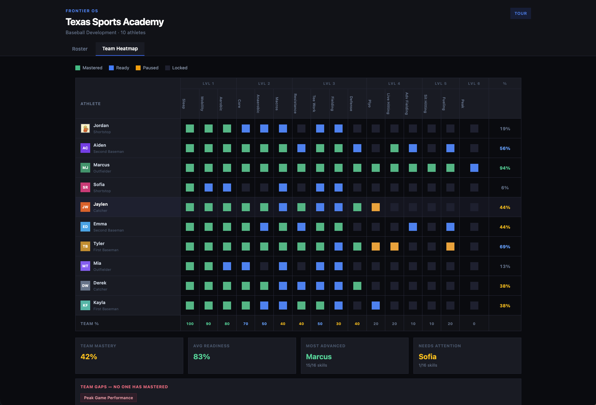
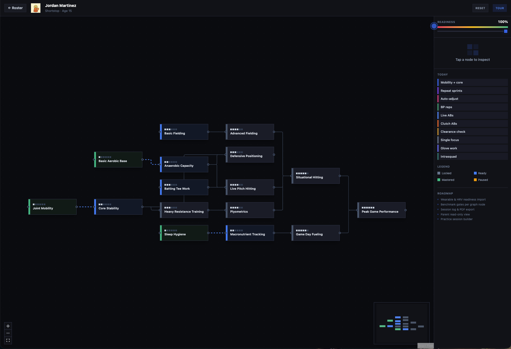
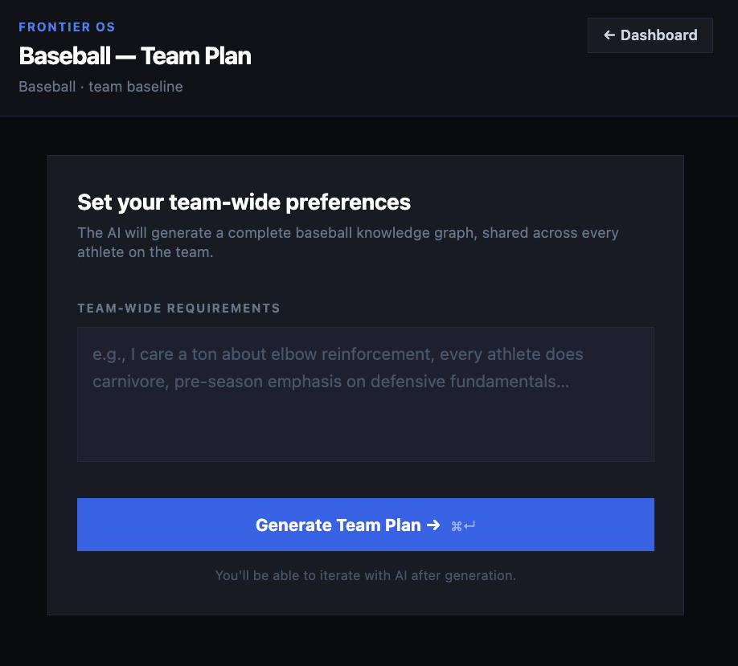
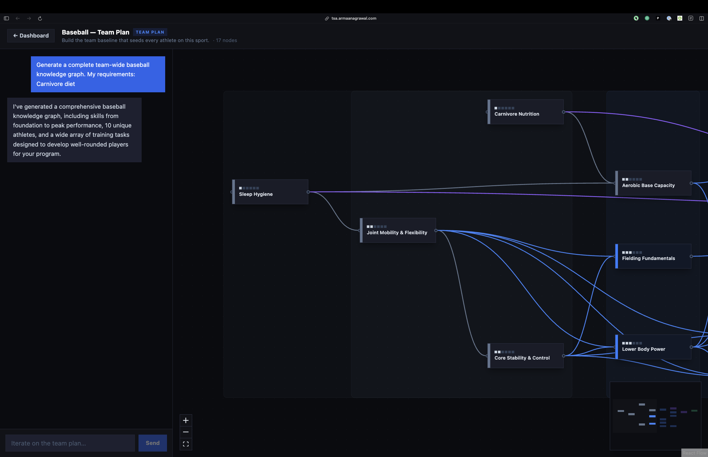
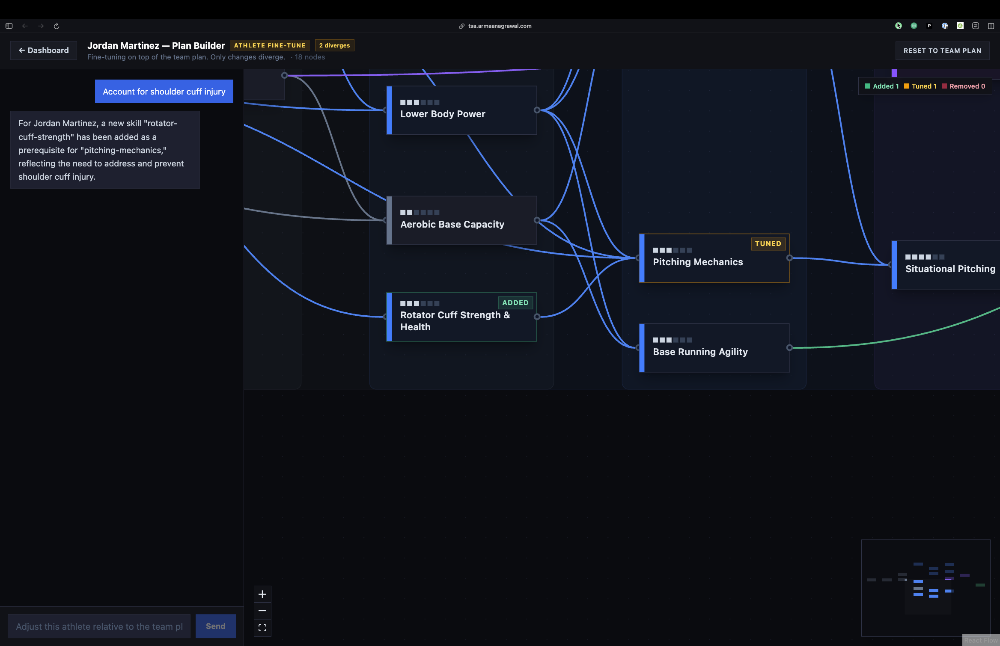
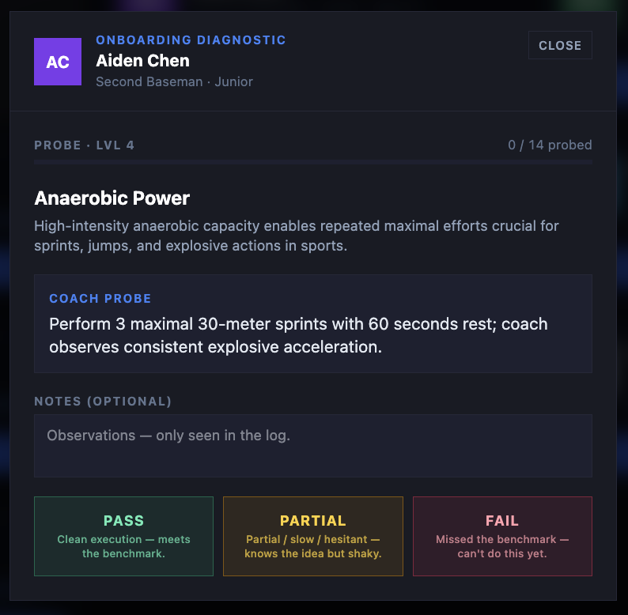
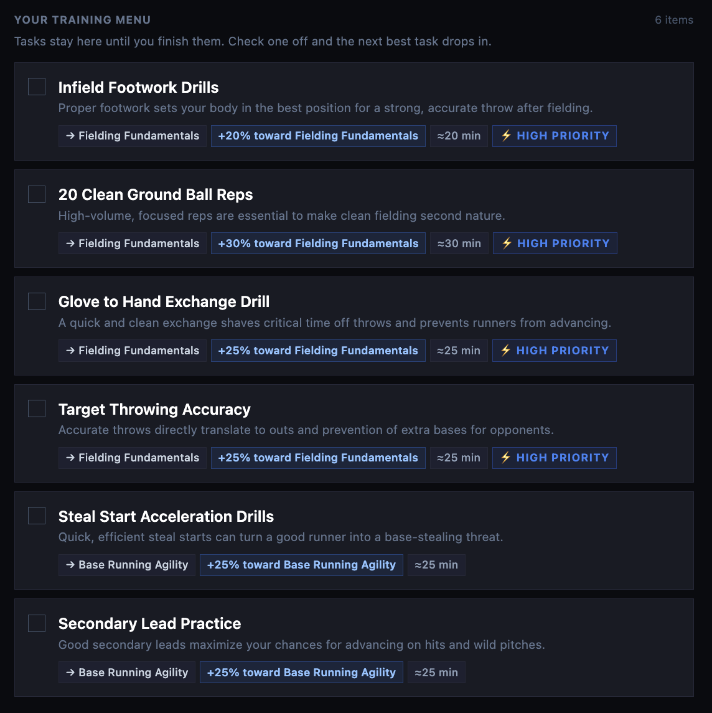

# Frontier OS

**You can't make every athlete the best. But you *can* make them a lot better, a lot faster than everyone else.**

---

## The Problem

Most training programs fail for two reasons:

1. **No accountability.** Deliberate practice is painful. Without structure, athletes half-ass it — and half-assing creates an *illusion of comprehension*. They feel like they're improving when they're not.
2. **Ignoring how the brain actually works.** The bottleneck to learning any skill is *working memory*. It can only hold a few things at once. If you overload it, nothing sticks.



## How Frontier OS Fixes It

### A knowledge graph of every skill in the sport

Instead of a flat checklist, Frontier OS maps skills as a connected graph — from Sleep Hygiene all the way up to Peak Game Performance. Each node has prerequisites, so when an athlete completes a complex task like an intrasquad scrimmage, the system gives credit for *every underlying skill* that task required (conditioning, fielding, situational hitting, etc.).

This means coaches always know exactly what an athlete can and can't do — and what they should work on next.



### Effortful retrieval, not passive repetition

The fastest way to build long-term memory is to *make the brain work to recall things*. That's why Frontier OS uses frequent low-stakes testing — pressure at-bats, clutch hitting drills, random pitch sequences. Research shows this kind of retrieval practice doesn't just build stronger memory, it actually *reduces* test anxiety over time because athletes get used to performing under pressure.

### Built-in accountability

Every skill node is gated by objective benchmarks. No social promotion. Athletes advance only when they demonstrate mastery — not when they've logged enough hours. The system also adjusts intensity based on real-time readiness (CNS fatigue, sleep, etc.), so athletes train at their actual edge instead of coasting or overreaching.

### Learning science techniques at every step

| Technique | What it does |
|---|---|
| **Spaced repetition** | Small daily doses beat one marathon block |
| **Interleaving** | Randomized practice mirrors in-game chaos |
| **Testing effect** | Pressure reps expose real gaps |
| **Non-interference** | One motor pattern per micro-cycle so skills don't blur |
| **Automaticity** | Drill until subconscious — frees working memory for game reads |
| **Encompassings** | Complex tasks that exercise many graph nodes at once |

---

## What's New

The original Frontier OS shipped with a single hand-built baseball graph. Everything below was added on top.

### The AI builds the graph for you

Any sport, any philosophy. A coach types what they want — *"High-school softball, every athlete does carnivore, pre-season emphasis on defensive fundamentals"* — and the AI generates a complete knowledge graph: skills, prerequisites, levels, and short diagnostic prompts for each node. Baseball, basketball, soccer, swimming, tennis, wrestling, volleyball all work out of the box, and anything else can be typed in free-form.

After the first generation, coaches can keep iterating in a chat panel next to a live graph preview. *"Add a mental game lane,"* *"merge these two nodes,"* *"simplify the strength branch"* — the graph updates in place.





### Team plan, then per-athlete fine-tunes

There are two layers:

- **Team Plan** — one shared baseline for everyone in the sport.
- **Athlete Fine-Tune** — each athlete can diverge from the baseline with their own AI-assisted adjustments (*"Emphasize rotator cuff prehab, swap plyos for low-impact alternatives"*).

Only the differences are stored per athlete, and the UI highlights them: added nodes glow, modified nodes get an amber border, and removed nodes appear as ghosts so the coach can see exactly how this athlete's plan diverges from the team's.



### Onboarding diagnostic

Before an athlete starts training, the coach runs a quick diagnostic to figure out what the athlete already knows. The system picks only the skills it actually needs to ask about (the current "frontier"), shows the coach a one-line probe prompt, and takes **Pass / Partial / Fail** as the verdict.

Everything else is inferred:

- **Pass on a higher skill** → all its prerequisites are also marked known.
- **Fail on a prerequisite** → its dependent skills are marked not-known.
- **Partial** → the skill is flagged *conditional* and gets extra review reps before it's promoted to mastered.

A typical athlete is fully onboarded in a few dozen probes instead of hundreds. When one athlete is done, the UI offers to chain straight into the next un-onboarded athlete on the roster.



### Re-onboarding when the plan changes

When a coach regenerates the team plan, previously-onboarded athletes don't have to redo everything. Their prior diagnostic results are fuzzy-matched onto the new graph by skill label, so mastery and conditional states carry over wherever the mapping is confident. Anything ambiguous is dropped (conservative) and the coach can override manually.

### Student detail view

Clicking an athlete opens their own page: today's tasks, their personalized skill tree scoped to their fine-tuned graph, spaced-repetition reviews that are due or coming up, and manual override buttons if the coach wants to flip a mastery state by hand. It's the single screen a coach uses during a session with one athlete.



---

## Workflow

The end-to-end coach flow, start to finish:

1. **Pick a sport** on the dashboard (or type in a custom one).
2. **Generate a team plan.** Describe your philosophy; the AI returns a full knowledge graph. Iterate in chat until it looks right.
3. **Onboard each athlete** with the diagnostic. A few dozen Pass / Partial / Fail calls, and the system knows where each athlete stands.
4. *(Optional)* **Fine-tune per athlete.** Describe what should be different for this kid; the AI diverges their plan from the team baseline.
5. **Run training.** Each athlete gets a daily task list generated from their current frontier, readiness, and spaced-repetition schedule. The coach tracks progress on the team heatmap and drills into individuals from the roster.

---

## Architecture at a glance

A single-page React app with a tiny serverless backend for AI calls.

- **Frontend** — Vite + React + TypeScript + Tailwind. All the interactive graph rendering is React Flow with a dagre layout.
- **State** — one Zustand store (`useFrontierStore`) holds the team plan, each athlete's delta, diagnostic results, mastery, conditional states, review schedules, and dashboard tasks. It's the single source of truth for every screen.
- **AI calls** — a Netlify Function (`netlify/functions/generate.ts`) proxies to OpenRouter with a strict JSON schema so the model always returns a well-formed graph. The same endpoint handles both "generate team plan" and "generate athlete fine-tune" via a `mode` flag. A mirror FastAPI service in `backend/` (Dockerized, deployed to Fly.io) exposes the same `POST /api/generate` for longer generations that exceed Netlify's function timeout; the frontend picks which backend to hit via `VITE_GENERATE_URL`, defaulting to the Netlify function.
- **Delta storage** — per-athlete graphs are stored as a *diff* against the team baseline (`added` / `removed` / `modified`), not as a full copy. One team plan edit propagates to everyone automatically, and each athlete's divergences stay put.
- **Diagnostic engine** — a small pure-TS module (`lib/diagnostic.ts`) that picks the next skill to probe, applies verdicts, propagates them up and down the prerequisite graph, and infers the rest.
- **Spaced repetition** — a stability/due-date tracker (`lib/fire.ts`) schedules reviews for mastered skills; the dashboard surfaces what's due today.

## Stack

Vite, React, TypeScript, Tailwind CSS, Zustand, React Flow, dagre, Netlify Functions, FastAPI on Fly.io, OpenRouter.

## Run locally

```bash
npm install
npm run dev
```

```bash
npm run build && npm run preview
```

The AI builder needs an `OPENROUTER_API_KEY` in your Netlify env (or a local `.env`) to actually hit the model; without it the app still runs but graph generation will error.

To run the FastAPI backend instead (longer timeouts for big graphs), see `backend/README.md` for the Docker/Fly.io deploy, then point the frontend at it:

```bash
VITE_GENERATE_URL=https://<your-app>.fly.dev/api/generate
```
